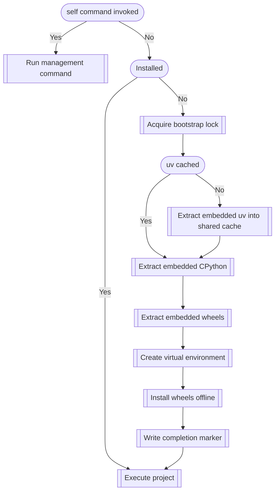

# Runtime behavior

Axe's runtime behavior is rewritten in Go: everything the app needs
is embedded in the binary.

## Initialization

Binaries bootstrap themselves on the first run. All subsequent invocations
only check that the installation marker exists and nothing else, to maximize
CLI responsiveness.

The nodes with rounded edges are conditions and those with jagged edges are
actions.

Step by step:

- **Installed** — a single `stat` of the `.axe-installed` marker inside the
  installation directory (`<data dir>/<app name>/<payload fingerprint>`). A
  new binary version has a new fingerprint, so it gets a fresh environment
  automatically. `AXE_DATA_DIR` overrides the base directory.
- **Bootstrap lock** — concurrent first runs are serialized with an
  exclusively-created lock file; stale locks from crashed processes are
  reclaimed. A directory without the completion marker is treated as crash
  residue and rebuilt from scratch.
- **uv cached** — the embedded uv release archive is extracted once into a
  shared cache (`<cache dir>/uv/<version>`) and reused by every axe app
  pinning the same uv version. `AXE_CACHE_DIR` overrides the location,
  `AXE_UV` bypasses it entirely.
- **Extract / venv / install** — the embedded python-build-standalone
  distribution and dependency wheels are unpacked, then uv creates the venv
  and installs the app with `--offline --no-index --find-links`. The runtime
  contains no network code at all.
- **Execute / manage** — `self` is the reserved management command group
  (`remove`, `restore`, `update` always; `python`, `python-path`, `cache`,
  `metadata` when exposed at build time); everything else goes to the app.
  Building with `self-command-group = false` drops the reservation entirely,
  so `self` reaches the app too.

### Differences from pyapp

pyapp's conditions that axe resolves at *build* time instead of runtime:

| pyapp runtime condition | axe |
| --- | --- |
| Distribution cached / embedded / from source | always embedded |
| Full isolation | not supported; always a venv |
| UV enabled / UV cached / download UV | uv always embedded, cached on first run |
| External pip / pip cached / download pip | uv only |
| Project embedded / dependency file / single project | project + dependency wheels always embedded |
| Management enabled | always enabled as `self` |

### Differences from PyInstaller

PyInstaller *freezes* an application: its bootloader unpacks a bundle of
modules collected by static import analysis and runs them inside an embedded
interpreter. Axe *installs* one: real wheels into a real venv with a full
CPython, once. That leads to very different runtime behavior:

| PyInstaller (onefile) | axe |
| --- | --- |
| Extracts to a fresh temp dir (`_MEIPASS`) on every run, deleted on exit | Unpacks once into a persistent per-app install; every later run is a marker check + exec |
| App runs inside the bootloader process with `sys.frozen` set | Process is replaced with a normal venv Python; only `AXE=1` marks the install |
| Modules collected by static import analysis; dynamic imports and data files need hooks/hidden-import hints | Dependencies installed as complete wheels; dynamic imports, package data, `importlib.metadata`, and entry points work as in any venv |
| `sys.executable` is the frozen binary, so subprocesses that re-invoke Python need special handling (e.g. `multiprocessing.freeze_support`) | `sys.executable` is a real interpreter on disk; subprocesses behave normally |
| Startup pays the extraction cost every run | Only the first run pays it |
| No install to manage or clean up beyond temp-dir residue | `self remove` / `restore` / `update` manage the cached install |

The trade-off is size and footprint: axe binaries embed a complete CPython
and every wheel (~45–60 MB) and leave a cached installation on disk, where
PyInstaller prunes to just what the app imports.

## Execution

Projects are executed using `execve` on non-Windows systems, replacing the
process (the entrypoint path is already fully resolved, so no PATH lookup is
involved). On Windows the app runs as a child process and its exit code is
forwarded.

To provide consistent behavior on each user's machine:

- Python runs projects in [isolated mode](https://docs.python.org/3/using/cmdline.html#cmdoption-I).
  Module (`-m pkg`) and spec (`pkg.mod:func`) entrypoints pass `-I` directly;
  console-script entrypoints get the environment equivalent (all `PYTHON*`
  variables are stripped, user site-packages and script-dir `sys.path`
  prepending are disabled).
- During installation, uv runs with configuration and environment influence
  disabled — the uv analogue of pip's `--isolated`: `UV_NO_CONFIG=1`,
  `UV_OFFLINE=1`, and any inherited `UV_*`, `PIP_*`, `PYTHON*`,
  `VIRTUAL_ENV`, or `CONDA_PREFIX` variables are dropped.

The app's environment gets `AXE=1` so it can detect axe installs;
`AXE_DEBUG=1` makes the stub verbose.
